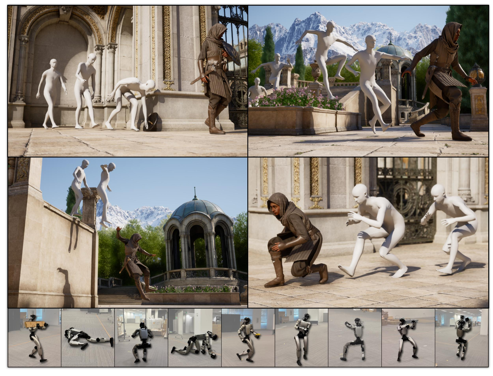
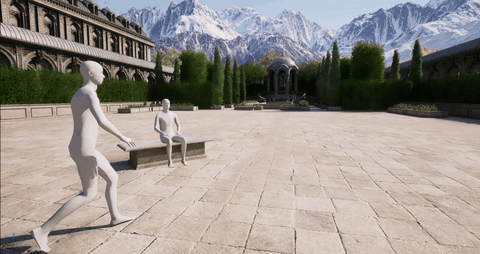

# MotionBricks: Scalable Real-Time Motions with Modular Latent Generative Model and Smart Primitives

<p align="center">
  <a href="https://nvlabs.github.io/motionbricks"></a>
  <a href="docs/motion_representation.md"></a>
</p>

<p align="center">
  
</p>

MotionBricks is a real-time generative framework that transforms interactive motion control for animation and robotics. By combining a large-scale latent backbone with intuitive "smart primitives," it delivers high-quality, zero-shot motion synthesis at 15,000 FPS, allowing users to effortlessly build complex animations and robotic movements like assembling bricks.

## Contents

- [Results](#results)
- [Setup](#setup)
- [Interactive Demo: Quick Start](#interactive-demo-quick-start)
- [Project Structure](#project-structure)
- [Known Issues](#known-issues)
- [Citation](#citation)
- [License](#license)
- [Contact](#contact)

## Results

See the [project page](https://nvlabs.github.io/motionbricks) for the full uncut demos and comparison videos. Short clips below are GIFs (muted, ~10 s each).

### Teasers

| Animation | Robotics |
| :---: | :---: |
|  |  |

### Smart Locomotion — Single Styles

| Zombie | Injured leg |
| :---: | :---: |
|  |  |
| **Injured torso** | **Skipping** |
|  |  |
| **Strafing** | **Crouch strafing** |
|  |  |

### Smart Locomotion — Mixture of Styles

| Freestyle | Idle · Walk · Jog · Run |
| :---: | :---: |
|  |  |

### Smart Objects

| Pick up sword | Falling |
| :---: | :---: |
|  |  |
| **Jump over bench** | **Sitting** |
|  |  |
| **Interactive authoring** | |
|  | |

## Setup

**Requirements:** Python 3.10+, a CUDA-capable GPU

### Clone the repository

```bash
git clone https://github.com/Aero-Ex/Nvidia_MotionBricks.git
cd Nvidia_MotionBricks/
```


### Install dependencies

```bash
# Create environment
conda create -n motionbricks python=3.10 -y
conda activate motionbricks

# Install dependencies
pip install -e .

# Linux only: needed for keyboard input and MuJoCo key-grab workaround
pip install pynput python-xlib

# install huggingface_hub
pip install -U transformers==5.1.0

# download the pretrained weights
python -c "from huggingface_hub import snapshot_download; snapshot_download(repo_id='Aero-Ex/NV_MotionBricks', local_dir='./out')"
```

## Interactive Demo: Quick Start

```bash
DISPLAY=:1 python scripts/interactive_demo_g1.py
```

This launches the MuJoCo viewer with the G1 robot. Use your keyboard to control it in real time. Hold the left mouse button and drag to change the camera look-at direction.

<p align="center">
  
</p>

### Movement Controls

| Key | Action |
|-----|--------|
| `W` | Move forward |
| `A` | Move left |
| `S` | Move backward |
| `D` | Move right |

The movement direction is relative to the camera. Rotate the camera by right-clicking and dragging in the MuJoCo viewer.

### Motion Styles

| Key | Style |
|-----|-------|
| `V` | Slow walk |
| `Z` | Hand crawling |
| `X` | Walk boxing |
| `B` | Elbow crawling |
| `R` | Stealth walk |
| `T` | Injured walk |
| `C` | Walk stealth (crouched) |
| `E` | Happy dance walk |
| `F` | Zombie walk |
| `G` | Gun walk |
| `Q` | Scared walk |

Note: crawling modes (`Z` hand crawling and `B` elbow crawling) currently do not support side-only directions.

Without pressing a style key, the default locomotion is: **idle** (no movement keys), **walk** (WASD pressed).


## Project Structure

```
motionbricks/
  assets/skeletons/g1/     # MuJoCo XMLs and STL meshes
  motionbricks/            # Python package
  scripts/
    interactive_demo_g1.py # Interactive demo
    train_vqvae.py         # VQVAE training
    train_pose.py          # Pose model training
    train_root.py          # Root model training
  out/                     # Pre-trained checkpoints (Git LFS)
    G1-clip.ckpt
    motionbricks_vqvae/
    motionbricks_pose/
    motionbricks_root/
  setup.py
```

## Known Issues

- **Linux/X11 only:** The keyboard key-grab workaround requires X11 (`python-xlib`). On Wayland, macOS, or Windows, some MuJoCo keyboard shortcuts may conflict with the controller keys. Keep the **terminal focused** (not the MuJoCo window) as a workaround.
- **`PYTORCH_JIT=0` disables key grabs:** Running with `PYTORCH_JIT=0` interferes with the X11 key-grab workaround. If you need `PYTORCH_JIT=0`, keep the terminal focused instead.
- The `pynput` package is required for keyboard input on Linux/macOS. On Windows, the `keyboard` package is used instead.

## Citation

If you use MotionBricks in your research, please cite:

```bibtex
@misc{wang2026motionbricksscalablerealtimemotions,
      title={MotionBricks: Scalable Real-Time Motions with Modular Latent Generative Model and Smart Primitives},
      author={Tingwu Wang and Olivier Dionne and Michael De Ruyter and David Minor and Davis Rempe and Kaifeng Zhao and Mathis Petrovich and Ye Yuan and Chenran Li and Zhengyi Luo and Brian Robison and Xavier Blackwell and Bernardo Antoniazzi and Xue Bin Peng and Yuke Zhu and Simon Yuen},
      year={2026},
      eprint={2604.24833},
      archivePrefix={arXiv},
      primaryClass={cs.RO},
      url={https://arxiv.org/abs/2604.24833},
}
```

## License

Source code in this repository is licensed under **Apache 2.0**. Pretrained model weights are licensed under the **NVIDIA Open Model License**, which permits commercial use with attribution subject to the trustworthy AI requirements.

## Contact

For questions and feedback, please reach out at **`gear-wbc@nvidia.com`**.
# Nvidia_MotionBricks
